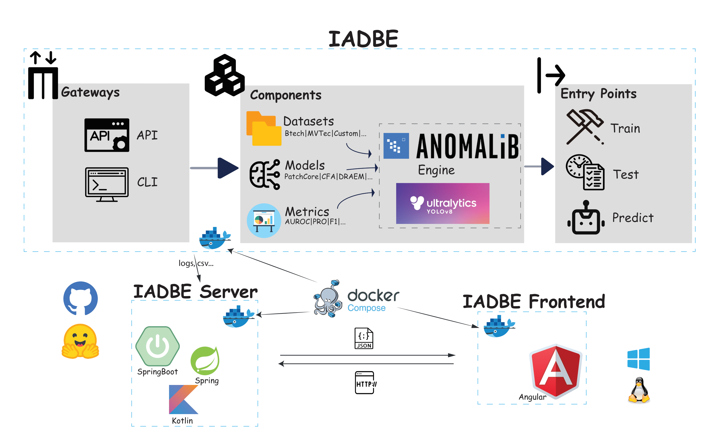

# 📚 Architecture
As you can see in the figure, the IADBE system is made up of three main parts: IADBE, IADBE Server, and IADBE Backend. IADBE is the system's core, with API and CLI acting as gateways. Datasets, Models, and Metrics are some of the system's most important parts. Models are based on open-source Anomalib and YOLOv8. The system has three main entry points: Train, Test, and Predict.



In IADBE Server, we've used the SpringBoot and Kotlin frameworks. IADBE Server gets training and testing results files from IADBE and then handles them, including logging and CSV processing. In IADBE Frontend, we've used the Angular framework. The frontend sends an HTTP request to the server, and the server then sends JSON data back to the frontend. The frontend provides visualisations that are both stylish and really functional.

To make the deployment process easier, we use the [Docker Compose](https://github.com/cjy513203427/IADBE/blob/master/DOCKER_COMPOSE.md) to put together the IADBE, IADBE Server, and IADBE Frontend images, and then run them together.
We use GitHub for version control. We publish all the relevant software, including [IADBE](https://github.com/cjy513203427/IADBE), [IADBE Server](https://github.com/cjy513203427/IADBE_Server), and [IADBE Frontend](https://github.com/cjy513203427/IADBE_Frontend), on GitHub so that it can be reproduced and verified. We've uploaded [custom datasets](https://huggingface.co/datasets/gt111lk/IADBE_Custom_Dataset) and [pre-trained models](https://huggingface.co/gt111lk/IADBE_Models) to Huggingface.
We've tested the cross-platform functionality on a range of operating systems, including Windows 11 and 10, as well as Ubuntu 22 and 20. It's been shown that these systems can run the IADBE system without any significant issues.
# 📖 Introduction
It is worth noting that previous research accompanying open-source projects often takes
a lot of time due to problems with environment deployment, and some projects do not work due to versioning
problems. However, in this project the solution will be deployed using Docker or Conda. The primary goal is to provide
researchers with a ready-to-use industrial anomaly detection platform. This platform is mainly based on [Anomalib](https://github.com/openvinotoolkit/anomalib) and partly based on [YOLOv8](https://github.com/ultralytics/ultralytics) should be able to
reproduce and identify previous research, be bug free and easy to deploy.

# 📦 Installation 
Tested on Linux (Ubuntu22/20), Windows (Win11/10) ✅

IADBE offers two ways to install the library: Conda and Docker. Use Conda if you want to make changes to dependencies and work in dev mode. 
Use Docker if you want to copy our environment (python, torch...) exactly. ⚠️We assume that you have installed the nvidia driver and CUDA. Otherwise, you can train on CPU.

<details>
<summary>Install from Conda</summary>
Installing the library with Conda

```bash
# Use of virtual environment is highly recommended
# Using conda
conda create -n IADBE python=3.10
conda activate IADBE

# To avoid anomalib install bug
pip install pip==24.0

# Install anomalib
pip install anomalib==1.1.0

# Install the full package, this will install Anomalib CLI. Anomalib CLI is a command line interface for training, testing.
anomalib install

# Install ultralytics
pip install ultralytics

# Or using your favorite virtual environment
# ...

```
</details>
    
<details>
<summary>Install from Docker</summary>
Installing the library with Docker

```bash
# Clone the repository and install in editable mode
git clone https://github.com/cjy513203427/IADBE.git
cd IADBE

# Build docker image
docker build --no-cache -t iadbe .
# Run docker container
docker run --gpus all -it --shm-size="8g" --name iadbe --rm iadbe bash
```
</details>
You can either use it as a virtual machine with the same command to train, test and inference or set docker env as your external environment.

# 📘 Dataset
## Standard Dataset
IADBE can download the standard datasets (MVTec, MVTec3D, Btech, VisA, Kolektor) with API/CLI automatically. If you have any issues with downloading the datasets, you can also download them directly from their official websites. 
## Custom Dataset
We've uploaded a custom dataset to [IADBE_Custom_Dataset](https://huggingface.co/datasets/gt111lk/IADBE_Custom_Dataset/tree/main). It's got both anomalib and YOLO format datasets.
You can import it with the Huggingface way, or just clone it from GitHub and download it to your local machine.

<details>
<summary>Use Huggingface</summary>

```python
from datasets import load_dataset

ds = load_dataset("gt111lk/IADBE_Custom_Dataset")
```
</details>

<details>
<summary>Use Git Clone</summary>

```bash
git clone https://huggingface.co/datasets/gt111lk/IADBE_Custom_Dataset
```
</details>

# 🧠 Training and Testing

IADBE supports both API and CLI-based training. The API is more flexible and allows for more customization, while the CLI training utilizes command line interfaces, and might be easier for those who would like to use IADBE off-the-shelf.

<details>
<summary>Training and Testing via API</summary>
A train_test_mvtec_xxx.py file looks like this. Run it with your IDE or <code>python train_test_mvtec_xxx.py</code> to start training default with whole MVTec dataset.

```python
import logging
from anomalib import TaskType
from anomalib.data import MVTec
from anomalib.engine import Engine
from anomalib.models import Padim

# configure logger
logging.basicConfig(level=logging.INFO, format='%(asctime)s - %(levelname)s - %(message)s')
logger = logging.getLogger(__name__)

datasets = ['screw', 'pill', 'capsule', 'carpet', 'grid', 'tile', 'wood', 'zipper', 'cable', 'toothbrush', 'transistor',
            'metal_nut', 'bottle', 'hazelnut', 'leather']

for dataset in datasets:
    logger.info(f"================== Processing dataset: {dataset} ==================")
    model = Padim()
    datamodule = MVTec(category=dataset, num_workers=0, train_batch_size=256,
                       eval_batch_size=256)
    engine = Engine(pixel_metrics=["AUROC", "PRO"], image_metrics=["AUROC", "PRO"], task=TaskType.SEGMENTATION)

    logger.info(f"================== Start training for dataset: {dataset} ==================")
    engine.fit(model=model, datamodule=datamodule)

    logger.info(f"================== Start testing for dataset: {dataset} ==================")
    test_results = engine.test(
        model=model,
        datamodule=datamodule,
        ckpt_path=engine.trainer.checkpoint_callback.best_model_path,
    )
```

</details>

<details>
<summary>Training and Testing via CLI</summary>
A train_test_mvtec_xxx.sh file looks like this. Run it with <code>bash train_test_mvtec_xxx.sh</code> to start training default with whole MVTec dataset.

```bash
#!/bin/bash

datasets=('screw' 'pill' 'capsule' 'carpet' 'grid' 'tile' 'wood' 'zipper' 'cable' 'toothbrush' 'transistor' 'metal_nut' 'bottle' 'hazelnut' 'leather')
config_file="./configs/models/padim.yaml"

for dataset in "${datasets[@]}"
do
    command="anomalib train --data anomalib.data.MVTec --data.category $dataset --config $config_file"
    echo "Running command: $command"
    # Excute command
    $command
done

```
For the futher use of anomalib cli, you can retrieve [Training via CLI from Training](https://github.com/openvinotoolkit/anomalib?tab=readme-ov-file#-training)  

</details>

# 🤖 Inference

Anomalib includes multiple inferencing scripts, including Torch, Lightning, Gradio, and OpenVINO inferencers to perform inference using the trained/exported model. Here we show an inference example using the Lightning inferencer.
If you want to test our pretrained model without training, you can find it on Huggingface [IADBE_Models](https://huggingface.co/gt111lk/IADBE_Models/tree/main).
<details>
<summary>Inference via API</summary>

The following example demonstrates how to perform Lightning inference by loading a model from a checkpoint file.

```python
# Assuming the datamodule, custom_model and engine is initialized from the previous step,
# a prediction via a checkpoint file can be performed as follows:
predictions = engine.predict(
    datamodule=datamodule,
    model=model,
    ckpt_path="path/to/checkpoint.ckpt",
)
```

</details>

<details>
<summary>Inference via CLI</summary>

```bash
# To get help about the arguments, run:
anomalib predict -h

# Predict by using the default values.
anomalib predict --model anomalib.models.Patchcore \
                 --data anomalib.data.MVTec \
                 --ckpt_path <path/to/custom_model.ckpt>

# Predict by overriding arguments.
anomalib predict --model anomalib.models.Patchcore \
                 --data anomalib.data.MVTec \
                 --ckpt_path <path/to/custom_model.ckpt>
                 --return_predictions

# Predict by using a config file.
anomalib predict --config <path/to/config> --return_predictions
```
</details>

# 📜 Custom Dataset Mode
IADBE can help you out with training and inference for your own custom dataset. The default dataset format is based on Anomalib, but you can use YOLO if you want to. Just check out [yolo_custom_dataset_setting](https://github.com/cjy513203427/IADBE/tree/master/yolo#custom-dataset).
1. The first thing you need to do is import your own dataset to the project and create a custom data configuration file.

<details>
<summary>Configuration with only Normal Images</summary>

```yaml
class_path: anomalib.data.Folder
init_args:
  name: "custom_dataset"
  root: "datasets/Custom_Dataset/hazelnut"
  normal_dir: "train/good"
  abnormal_dir: "test/crack"
  mask_dir: null
  normal_split_ratio: 0.2
  test_split_mode: synthetic
```

</details>

<details>
<summary>Configuration with Normal and Abnormal Images</summary>

```yaml
class_path: anomalib.data.Folder
init_args:
  name: "custom_dataset"
  root: "datasets/Custom_Dataset/chest_xray"
  normal_dir: "train/good"
  abnormal_dir: "test/crack"
  normal_test_dir: "test/good"
  normal_split_ratio: 0
  extensions: [".png"]
  image_size: [256, 256]
  train_batch_size: 32
  eval_batch_size: 32
  num_workers: 8
  task: classification
  train_transform: null
  eval_transform: null
  test_split_mode: synthetic
  test_split_ratio: 0.2
  val_split_mode: same_as_test
  val_split_ratio: 0.5
  seed: null
```
</details>

2. Next, you'll want to choose a model and then train it with a custom dataset.
```bash
anomalib train --data <path/to/custom_dataset.yaml> --model anomalib.models.Padim 
```

3. Finally, you can run an inference with the trained model to get the predicted results.
```bash
anomalib predict --model anomalib.models.Padim \
                 --data <path/to/custom_dataset/custom_image.png> \
                 --ckpt_path <path/to/custom_dataset.ckpt>
```

# 📊 Benchmark Results
These are partial results of benchmark. You can find more details in my paper under folder `papers/`. The results come from raw logs, which you can find under `logs/rawlogs`.
## Image Level AUROC on MVTec
|           | Screw     | Pill      | Capsule   | Carpet     | Grid      | Tile       | Wood      | Zipper    | Cable     | Toothbrush | Transistor | Metal Nut  | Bottle     | Hazelnut   | Leather    | Average   |
|-----------|-----------|-----------|-----------|------------|-----------|------------|-----------|-----------|-----------|------------|------------|------------|------------|------------|------------|-----------|
| CFA       | 87.68     | 93.10     | 48.17     | 50.00      | 84.04     | 37.50      | 62.50     | 40.34     | 61.96     | **98.06**  | 45.00      | 39.78      | 50.00      | 60.00      | 50.00      | 60.54     |
| CFLOW     | 81.57     | 92.91     | **95.45** | **97.27**  | 88.47     | **100.00** | **99.39** | **97.64** | 94.15     | 94.17      | 94.88      | **100.00** | **100.00** | **99.68**  | **100.00** | **95.71** |
| CSFLOW    | 41.58     | 38.09     | 60.77     | **99.16**  | 78.36     | 90.44      | **95.75** | 88.93     | 67.31     | 44.72      | 50.54      | 74.46      | 89.92      | 71.02      | **100.00** | 72.74     |
| DFKDE     | 69.17     | 64.18     | 72.04     | 68.42      | 46.69     | 92.50      | 81.32     | 88.26     | 68.67     | 78.89      | 81.12      | 76.20      | 92.94      | 77.57      | 77.79      | 75.72     |
| DFM       | 77.79     | **96.89** | 92.98     | 90.93      | 65.41     | **98.67**  | **97.81** | **97.51** | 94.27     | **96.39**  | 94.79      | 91.72      | **100.00** | **96.82**  | **100.00** | 92.80     |
| DRAEM     | 30.01     | 74.55     | 77.02     | 72.47      | 80.45     | 86.80      | **95.96** | 78.90     | 63.98     | 70.42      | 90.21      | 93.55      | **98.10**  | 77.50      | 86.65      | 78.44     |
| DSR       | 56.67     | 70.16     | 72.72     | 43.82      | **97.08** | 80.70      | 90.75     | 78.97     | 76.96     | **96.94**  | 91.04      | 81.04      | 86.59      | 81.64      | 83.97      | 79.27     |
| FASTFLOW  | 65.85     | 76.60     | 69.64     | 93.38      | **96.32** | 93.36      | **98.16** | 72.69     | 67.62     | 72.50      | 89.62      | 81.33      | **99.68**  | 79.86      | **99.90**  | 83.77     |
| GANomaly  | 32.79     | 59.96     | 26.57     | 21.71      | 57.23     | 54.42      | 60.88     | 41.05     | 52.47     | 49.17      | 33.46      | 26.30      | 47.78      | 53.86      | 36.68      | 43.62     |
| PaDiM     | 78.95     | 79.95     | 86.48     | **97.99**  | 87.47     | 94.55      | **97.46** | 77.46     | 85.96     | 82.50      | 94.54      | **98.34**  | **99.52**  | 88.32      | **100.00** | 89.97     |
| PatchCore | **98.11** | 94.76     | **97.85** | **99.12**  | **98.08** | **98.81**  | **98.77** | **99.21** | **99.10** | **100.00** | **100.00** | **99.80**  | **100.00** | **100.00** | **100.00** | **98.91** |
| RD        | **98.03** | **97.63** | **97.93** | **99.36**  | **95.49** | **100.00** | **99.39** | **97.16** | **95.45** | 91.39      | **97.87**  | **100.00** | **100.00** | **100.00** | **100.00** | **97.98** |
| RKDE      | 50.58     | 68.77     | 51.93     | -          | 75.36     | 67.72      | 62.54     | 75.37     | 85.83     | 77.17      | 65.00      | 90.63      | 85.07      | **100.00** | **100.00** | 75.43     |
| STFPM     | 77.62     | 40.78     | 60.59     | **98.88**  | 59.23     | **97.08**  | **98.95** | 75.39     | 91.34     | 47.50      | 61.88      | 40.22      | 43.97      | 96.50      | **100.00** | 72.66     |
| UFLOW     | 49.19     | 94.84     | 56.72     | **100.00** | **99.33** | **99.39**  | **95.09** | 89.73     | 62.67     | 64.17      | 81.46      | 55.77      | **99.21**  | 90.39      | **100.00** | 82.53     |

## Image Level AUROC on VisA
|           | Candle         | Capsules | Cashew         | Chewinggum     | Fryum           | Macaroni1      | Macaroni2 | PCB1           | PCB2           | PCB3           | PCB4            | Pipe Fryum     | Average |
|-----------|----------------|----------|----------------|----------------|-----------------|----------------|-----------|----------------|----------------|----------------|-----------------|----------------|---------|
| CFA       | 85.49          | 12.67    | 19.12          | **96.12**      | 19.12           | 88.20          | 59.00     | 94.91          | 93.31          | 90.27          | **99.04**       | 19.12          | 75.32   |
| CFLOW     | 89.24          | 94.22    | **95.60**      | **99.66**      | 80.48           | 74.59          | 66.63     | 87.86          | 88.12          | 74.47          | **96.50**       | **98.12**      | 87.12   |
| CSFLOW    | 36.69          | 55.96    | 41.39          | 67.73          | 39.54           | 52.00          | 38.75     | 63.75          | 49.53          | 55.11          | 75.28           | 31.83          | 52.46   |
| DFKDE     | 85.91          | 59.15    | 86.32          | 82.86          | 75.94           | 65.47          | 45.47     | 67.19          | 66.20          | 69.61          | 83.19           | 77.79          | 72.09   |
| DFM       | **95.23**      | 57.63    | **95.86**      | **98.46**      | **95.22**       | 76.92          | 70.17     | 93.07          | 86.92          | 85.45          | **97.47**       | 90.04          | 87.21   |
| DRAEM     | 77.33          | 73.80    | 89.16          | 72.54          | 79.02           | 77.44          | 66.49     | 72.96          | 90.77          | 88.99          | **95.67**       | 82.06          | 80.52   |
| DSR       | 65.80          | 77.63    | 88.80          | 91.94          | 83.54           | 81.14          | 65.81     | **95.65**      | **96.31**      | 94.81          | **98.29**       | 78.35          | 84.84   |
| FASTFLOW  | **95.24**      | 78.87    | 89.00          | **98.28**      | 92.82           | 88.41          | 75.74     | 88.93          | 88.10          | 85.57          | **96.34**       | 92.00          | 89.11   |
| GANomaly  | 69.67          | 67.23    | 80.96          | 56.78          | 89.52           | 64.24          | 49.48     | 27.38          | 31.19          | 22.16          | 54.83           | 49.58          | 55.25   |
| PaDiM     | 81.06          | 64.85    | 91.30          | **97.66**      | 87.90           | 83.42          | 69.71     | 86.34          | 84.92          | 75.91          | **95.91**       | 91.28          | 84.19   |
| PatchCore | **98.34**      | 72.48    | **96.32**      | **99.22**      | **95.60**       | 86.97          | 71.52     | 94.20          | 93.86          | 93.11          | **99.07**       | **99.24**      | 91.66   |
| RD        | 94.22          | 87.52    | **96.90**      | **99.42**      | 90.62           | **96.21**      | 84.77     | **95.79**      | **97.02**      | **96.51**      | **99.89**       | **98.46**      | 94.78   |
| RKDE      | 73.97          | 60.90    | 85.16          | 64.46          | 77.98           | 62.51          | 46.59     | 68.51          | 78.08          | 74.20          | 49.55           | 73.43          | 67.95   |
| STFPM     | 76.44          | 88.17    | 59.22          | 91.32          | 93.80           | 74.04          | 89.62     | **95.22**      | 73.44          | 90.73          | 92.13           | **95.30**      | 84.95   |
| UFLOW     | 92.87          | 87.45    | 94.94          | **99.34**      | 93.62           | **97.80**      | 78.58     | **95.85**      | **96.27**      | **96.83**      | **96.90**       | **97.46**      | 93.99   |

## Image Level AUROC on MVTec3D
|           | Bagel          | Cable Gland | Carrot | Cookie | Dowel          | Foam  | Peach | Potato | Rope           | Tire  | Average        |
|-----------|----------------|-------------|--------|--------|----------------|-------|-------|--------|----------------|-------|----------------|
| CFA       | 8.52           | 53.97       | 19.61  | 7.91   | 46.15          | 86.94 | 78.81 | 56.77  | 92.07          | 0.00  | 45.08          |
| CFLOW     | 91.43          | 69.35       | 73.48  | 67.06  | **98.82**      | 68.56 | 70.39 | 55.73  | 94.79          | 74.16 | 76.38          |
| CSFLOW    | 53.33          | 61.03       | 43.41  | 48.16  | 38.31          | 70.69 | 56.62 | 33.45  | 72.55          | 63.84 | 54.14          |
| DFKDE     | 64.36          | 71.67       | 73.25  | 49.10  | 72.97          | 53.87 | 58.24 | 52.57  | 83.11          | 42.30 | 62.14          |
| DFM       | 92.51          | 66.78       | 45.38  | 31.52  | 45.23          | 33.19 | 59.51 | 65.81  | 84.83          | 59.45 | 58.42          |
| DRAEM     | 88.02          | 71.10       | 56.78  | 50.87  | 44.79          | 14.03 | 71.12 | 70.65  | 59.78          | 62.16 | 58.93          |
| DSR       | 81.87          | 76.25       | 71.21  | 36.51  | 70.58          | 53.37 | 60.14 | 55.26  | 48.19          | 57.29 | 61.07          |
| FASTFLOW  | 83.99          | 66.28       | 78.09  | 71.67  | 67.68          | 72.62 | 48.40 | 40.51  | 88.27          | 67.31 | 68.48          |
| GANomaly  | 36.78          | 65.96       | 50.22  | 2.84   | 62.72          | 47.87 | 59.00 | 56.87  | 40.49          | 44.83 | 46.76          |
| PaDiM     | **95.71**      | 73.56       | 64.83  | 62.48  | 89.68          | 64.50 | 72.50 | 53.51  | 76.36          | 80.97 | 73.41          |
| PatchCore | 92.72          | 91.95       | 86.84  | 74.48  | 97.86          | 72.56 | 84.94 | 60.13  | 94.66          | 79.95 | 83.61          |
| RD        | **96.18**      | 90.75       | 91.44  | 66.40  | **99.33**      | 83.56 | 84.43 | 68.38  | -              | -     | **95.06**      |
| RKDE      | 51.81          | 71.43       | 47.00  | 60.85  | 56.32          | 53.87 | 53.92 | 41.90  | 35.85          | 56.28 | 52.92          |
| STFPM     | 91.74          | 84.35       | 64.20  | 49.38  | 82.66          | 73.44 | 68.65 | 52.52  | 93.98          | 51.13 | 71.21          |
| UFLOW     | **95.40**      | 88.40       | 84.34  | 51.28  | **96.89**      | 62.44 | 60.49 | 57.02  | **96.24**      | 60.92 | 75.34          |

## Image Level AUROC on Btech
|           | 01             | 02    | 03             | Average        |
|-----------|----------------|-------|----------------|----------------|
| CFA       | 21.77          | 76.90 | **99.13**      | 65.93          |
| CFLOW     | **97.08**      | 85.40 | **99.70**      | 94.06          |
| CSFLOW    | 25.12          | 73.10 | 29.38          | 42.53          |
| DFKDE     | 93.88          | 78.40 | **99.14**      | 90.47          |
| DFM       | **99.32**      | 86.57 | **99.99**      | **95.29**      |
| DRAEM     | 91.45          | 80.42 | 85.66          | 85.84          |
| DSR       | **95.63**      | 73.75 | **95.33**      | 88.24          |
| FASTFLOW  | **99.71**      | 85.47 | 90.91          | 92.03          |
| GANomaly  | 73.18          | 35.00 | 41.97          | 50.05          |
| PaDiM     | **99.71**      | 87.27 | **99.57**      | **95.52**      |
| PatchCore | **97.76**      | 83.03 | **99.99**      | 93.59          |
| RD        | **99.61**      | 86.25 | **99.98**      | **95.28**      |
| RKDE      | 92.03          | 73.78 | 85.61          | 83.81          |
| STFPM     | **95.43**      | 81.37 | **99.89**      | 92.23          |
| UFLOW     | **98.93**      | 85.55 | **96.42**      | 93.63          |

## Image Level AUROC on Kolektor
|          | CFA   | CFLOW | CSFLOW | DFKDE | DFM | DRAEM | DSR   | FASTFLOW | GANomaly | PaDiM | PatchCore | RD    | RKDE  | STFPM | UFLOW |
|----------|-------|-------|--------|-------|-----|-------|-------|----------|----------|-------|-----------|-------|-------|-------|-------|
| Kolektor | 52.77 | 86.65 | 58.70  | 67.84 | -   | -     | 57.72 | 77.36    | 56.68    | 80.25 | 86.76     | 88.24 | 64.08 | 66.24 | 90.91 |